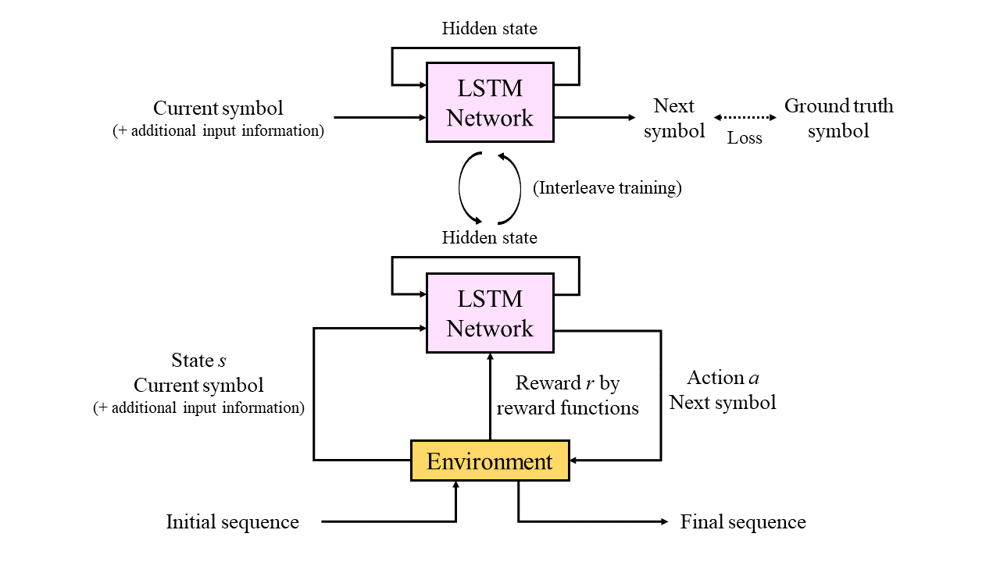
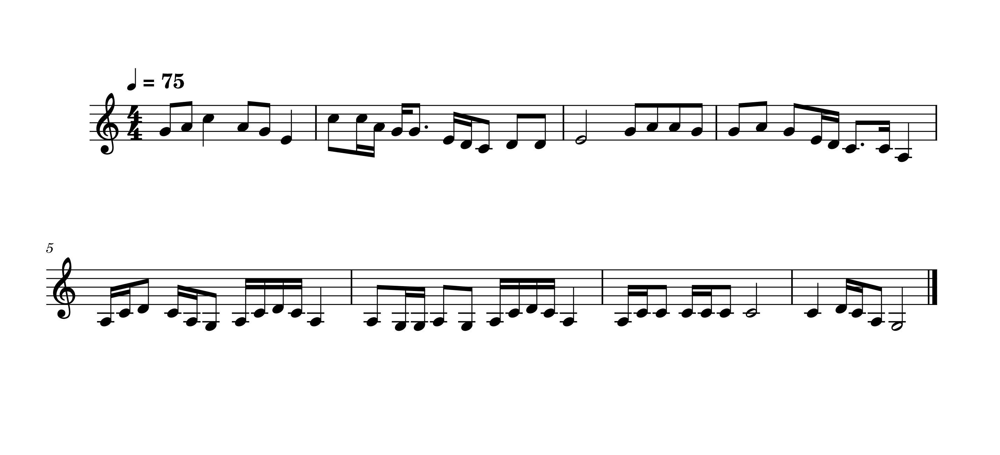

Code for thesis "Combining Deep Supervised Learning and Reinforcement Learning for Music Melody Generation"

### Abstract

In this work, we present a symbolic music melody generation method that combines supervised learning and reinforcement learning. For using deep learning in symbolic music modeling tasks, music clips can be processed as sequences of symbols along time, so sequence models with the temporal information modeling ability usually be used, just like other sequential modeling tasks, such as text modeling or natural language processing. In these kind of supervised approaches, deep neural network is able to capture the musical features from the existing dataset automatically. However, music compositions by human composers usually have some well-defined structures and conventional rules of music theory that please the audience. These constraints can be enforced into neural network using reinforcement learning which cannot achieve using supervised learning techniques only. By combining these two major training architectures in deep learning, we can make the model mimic the style of the existing dataset and also control specific behaviors of the generated melody. We also investigate the design of input representation and architecture to make the model capture the music structure feature easier. In the experiments, we focus on monophonic melody generation of Chinese Jiangnan style music, and validate the quality and some characteristics of the generated result, as well as the effectiveness of different modules in the architecture.

### Architecture Overall

### Demo

A 8-bars generated example.

### References

[1]	John Schulman, Filip Wolski, Prafulla Dhariwal, Alec Radford, Oleg Klimov. “Proximal Policy Optimization Algorithms”. arXiv:1707.06347, 2017.

[2]	Natasha Jaques, Shixiang Gu, Richard E. Turner, Douglas Eck. “Tuning Recurrent Neural Networks with Reinforcement Learning”. arXiv:1611.02796v2, 2016.

[3]	Hado van Hasselt, Arthur Guez, David Silver. “Deep Reinforcement Learning with Double Q-learning”. arXiv:1509.06461, 2015.

[4]	Sepp Hochreiter, Jürgen Schmidhuber. “Long Short-Term Memory”. Neural Computation, 1997.

[5]	Peter M. Todd. “A Connectionist Approach to Algorithmic Composition”. Computer Music Journal (CMJ), Vol. 13, No. 4, pp. 27-43, 1989.

[6]	Michael C. Mozer. “Neural Network Music Composition by Prediction: Exploring the Benefits of Psychophysical Constraints and Multi-scale Processing”. Connection Science, Vol. 6 (2-3):247-280, 1994.

[7]	Alex Graves. “Generating Sequences With Recurrent Neural Networks”. arXiv:1308.0850v5, 2014.

[8]	Douglas Eck, Jürgen Schmidhuber. “A First Look at Music Composition using LSTM Recurrent Neural Networks”. IDSIA/USI-SUPSI, Technical Report No. IDSIA-07-02, Switzerland, 2002.

[9]	Gaëtan Hadjeres, François Pachet, Frank Nielson. “DeepBach: a Steerable Model for Bach Chorales Generation”. arXiv:1612.01010v2, 2016.

[10]	Ian J. Goodfellow, Jean Pouget-Abadie, Mehdi Mirza, Bing Xu, David Warde-Farley, Sherjil Ozair, Aaron Courville, Yoshua Bengio. “Generative Adversarial Networks”. arXiv:1406.2661, 2014.’

[11]	Olof Mogren. “C-RNN-GAN: Continuous recurrent networks with adversarial training”. arXiv:1611.09904, 2016.

[12]	Hao-Wen Dong, Wen-Yi Hsiao, Li-Chia Yang, Yi-Hsuan Yang. “MuseGAN: Multi-track Sequential Generative Adversarial Networks for Symbolic Music Generation and Accompaniment”. arXiv:1709.06298v2, 2017.

[13]	Ashish Vaswani, Noam Shazeer, Niki Parmar, Jakob Uszkoreit, Llion Jones, Aidan N. Gomez, Łukasz Kaiser, Illia Polosukhin. “Attention Is All You Need”. arXiv:1706.03762v5, 2017.

[14]	Cheng-Zhi Anna Huang, Ashish Vaswani, Jakob Uszkoreit, Noam Shazeer, Ian Simon, Curtis Hawthorne, Andrew M. Dai, Matthew D. Hoffman, Monica Dinculescu, Douglas Eck. “Music Transformer: Generating Music with Long-Term Structure”. arXiv:1809.04281v3, 2018.

[15]	Nan Jiang, Sheng Jin, Zhiyao Duan, Changshui Zhang. “RL-Duet: Online Music Accompaniment Generation Using Deep Reinforcement Learning”. arXiv:2002.03082, 2020.

[16]	Volodymyr Mnih, Koray Kavukcuoglu, David Silver, Alex Graves, Ioannis Antonoglou, Daan Wiestra, Martin Riedmiller. “Playing Atari with Deep Reinforcement Learning”. arXiv:1312.5602, 2013.

[17]	Long short-term memory, Wikipedia. https://en.wikipedia.org/wiki/Long_short-term_memory#/media/File:LSTM_Cell.svg

[18]	Xuefei Huang, Seung Ho Hong, Mengmeng Yu, Yuemin Ding, Junhui Jiang. “Demand Response Management for Industrial Facilities: A Deep Reinforcement Learning Approach”. IEEE Access, vol. 7, pp. 82194-82205, 2019.

[19]	Daphné Lafleur, Sarath Chandar, Gilles Pesant. “Combining Reinforcement Learning and Constraint Programming for Sequence-Generation Tasks with Hard Constraints”. 28th International Conference on Principles and Practice of Constraint Programming (CP 2022), 2022.

[20]	Harish Kumar, Balaraman Ravindran. “Polyphonic Music Composition with LSTM Neural Networks and Reinforcement Learning”. arXiv:1902.01973v2, 2019.

[21]	Training an RNN without Supervision, Machine Learning for Scientists. https://ml-lectures.org/docs/unsupervised_learning/ml_unsupervised-2.html

[22]	Zheng Sun, Jiaqi Liu, Zewang Zhang, Jingwen Chen, Zhao Huo, Ching Hua Lee, Xiao Zhang. “Composing Music with Grammar Argumented Neural Networks and Note-Level Encoding”. arXiv:1611.05416v2, 2016.

[23]	Pedro Borges. Deep Learning: Recurrent Neural Networks. https://medium.com/deeplearningbrasilia/deep-learning-recurrent-neural-networks-f9482a24d010

[24]	Jian Wu, Changran Hu, Yulong Wang, Xiaolin Hu, Jun Zhu. “A Hierarchical Recurrent Neural Network for Symbolic Melody Generation”. arXiv:1712.05274v2, 2017.

[25]	Recurrent PPO, Stable Baselines3 - Contrib https://sb3-contrib.readthedocs.io/en/master/modules/ppo_recurrent.html

[26]	Sho Takase, Naoaki Okazaki. “Positional Encoding to Control Output Sequence Length”. arXiv:1904.07418, 2019.

[27]	PyTorch. https://pytorch.org/

[28]	LSTM. PyTorch. https://pytorch.org/docs/stable/generated/torch.nn.LSTM.html

[29]	Shulei Ji, Xinyu Yang, Jing Luo, and Juan Li. “RL-Chord: CLSTM-Based Melody Harmonization Using Deep Reinforcement Learning”. IEEE Transactions on Neural Networks and Learning Systems (Early Access), 2023.

[30]	Diederik P. Kingma, Jimmy Lei Ba. “Adam: A Method for Stochastic Optimization”. arXiv:1412.6980v9, 2014.

[31]	Sageev Oore, Ian Simon, Sander Dieleman, Douglas Eck, Karen Simonyan. “This Time with Feeling: Learning Expressive Musical Performance”. arXiv:1808.03715, 2018.

[32]	Proximal Policy Optimization. OpenAI. https://openai.com/research/openai-baselines-ppo

[33]	John Schulman, Sergey Levine, Philipp Moritz, Michael Jordan, Pieter Abbeel. “Trust Region Policy Optimization”. arXiv:1502.05477v5, 2015.

[34]	Magenta, Google. https://magenta.tensorflow.org/

[35]	Jean-Pierre, Gaëtan Hadjeres, François-David Pachet. “Deep Learning Techniques for Music Generation – A Survey”. arXiv:1709.01620v4, 2017.

[36]	Nonchord tone, Wikipedia. https://en.wikipedia.org/wiki/Nonchord_tone

[37]	施國琛, 張儷瓊, 黃志方, 孫沛立. “Erhu Performance and Music Style Analysis Using Artificial Intelligence” (“以人工智慧實踐二胡演奏行為暨音樂風格分析”). 國家科學及技術委員會 NSTC 112-2420-H-008-002.

[38]	“中國民間歌曲集成”. 中國民間歌曲集成全國編輯委員會, 1988.

[39]	蒲亨強. “江蘇地域音樂文化”. 2014. 

[40]	劉健. “葫蘆絲作品風格研究”. 2013.

[41]	周美妤. “朱昌耀《揚州小調》、《江南春色》作品分析與詮釋”. 2016.

